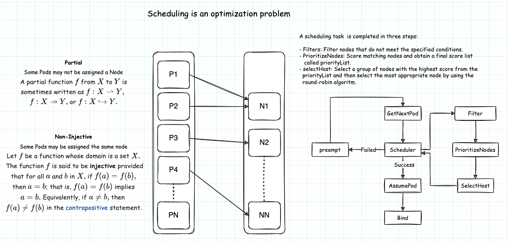

# Preparing for the CKA in 15 days.

CKA is designed to test if the candidates have enough knowledge and skills to be K8s administrators. You need to know what skills and abilities the CKA expect the candidates to demonstrate in the exam so that you can align your daily practices with these requirements accordingly during preparation.

Be sure to read the CNCF CKA Exam Curriculum to understand what’s included in the CKA exam. The curriculum may change a little bit along with every K8s release; here is the outline when I take the exam:

-   25% — Cluster Architecture, Installation & Configuration
-   15% — Workloads & Scheduling
-   20% — Services & Networking
-   10% — Storage
-   30% — Troubleshooting

The CKA exam is two hours long. The examinee needs to solve 17 questions during the exam. In each question, there is a given scenario and a problem to solve. Most questions are not so straightforward, and the candidate often needs 3 or 4 steps to finish one question. So the time is quite tight. You need to use the time smartly and effectively without wasting time waiting, searching, or any things not directly related to problem-solving.

Perseverance leads to success. I strongly suggest you don’t skip a single day because if you skip one day and make an exception, there’s a good chance that it will be a second time, a third time…. You’ll fall into a spiral of missing practice and regret, and this kind of negative emotion does not help you pass the exam.

## Courses
- CKA Certification Course - Certified Kubernetes Administrator. [Link](https://kodekloud.com/courses/certified-kubernetes-administrator-cka/)
- How to prepare for the CKA Exam [Link](https://kube.academy/courses/how-to-prepare-for-the-cka-exam)
- 

## Links
- Training and Certification [Link](https://docs.linuxfoundation.org/tc-docs/)
- Kubernetes The Hard Way [Link](https://github.com/kelseyhightower/kubernetes-the-hard-way)
- How to Pass the Certified Kubernetes Administratos (CKA) Exam Without Any Stress? [Link](https://www.zhaohuabing.com/post/2022-02-08-how-to-prepare-cka-en/)
- CKA Exam Study Guide: A Complete Resource for CKA Aspirants [Link](https://devopscube.com/cka-exam-study-guide/)
- Learn Kubernetes Basic https://kubernetes.io/docs/tutorials/kubernetes-basics/

- https://github.com/alijahnas/CKA-practice-exercises 
- https://github.com/walidshaari/Kubernetes-Certified-Administrator
- https://github.com/StenlyTU/K8s-training-official
- https://github.com/ramitsurana/awesome-kubernetes
- https://labs.play-with-k8s.com/ 

## Books
- The book _**Kubernetes in action**_ gives good general overview. The book can be [_downloaded_](https://github.com/indrabasak/Books/blob/master/Kubernetes%20in%20Action.pdf) from Internet.
- 

## Day 1
- Review Linux Foundation Certification Exam: Candidate Handbook. [Link](https://docs.linuxfoundation.org/tc-docs/certification/lf-handbook2)
- CKA Certification Course - Certified Kubernetes Administrator. [Link](https://kodekloud.com/courses/certified-kubernetes-administrator-cka/)  Core Concepts.

### Some concepts.

#### Kubernetes Objects
The following are the main Kubernetes objects we're going to use in our daily life while working with Kubernetes cluster:

- **Pod**. The smallest deployable unit in Kubernetes is a Pod. the worker node hosts the Pods, which contain the actual application workload. The applications are packaged and deployed in the containers. A single Pod contains one or more containers.

- **ReplicaSet**. ReplicaSet helps Pods achieve availability when users define a certain number of replicas at a time with a ReplicaSet. The role of the ReplicaSet is to make sure the cluster will always have an exact number of replicas up and running in the Kubernetes cluster. If any of them were to fail, new ones will be deployed.

- **DaemonSet**. DaemonSet is like ReplicaSet, but it makes sure at least one copy of your Pod is evenly presented on each node in the Kubernetes cluster. If a new node is added to the cluster, a replica of that Pod is automatically assigned to that node. Similarly, when a node is removed, the Pod is automatically removed.

- **StatefulSet**. StatefulSet is used to manage stateful applications. Users can use StatefulSet when a storage volume is needed to provide persistence for the workload.

- **Job**. A job can be used to reliably execute a workload automatically. When it completes, typically, a job will create one or more Pods. After the job is finished, the containers will exit and the Pods will enter the Completed status. An example of using jobs is when we want to run a workload with a particular purpose and make sure it runs once and succeeds.

- **CronJob**. CronJobs are based on the capability of a job by adding value to allow users to execute jobs on a schedule. Users can use a cron expression to define a particular schedule per requirement.

- **Deployment**. A Deployment is a convenient way where you can define the desired state Deployment, such as deploying a ReplicaSet with

#### YAML manifest
Each YAML file that is created for Kubernetes must contain four mandatory keys:

- **apiVersion**. This field tells you in which API version the resource is declared. Each resource type has an apiVersion key that must be set in this field. The pod resource type is in API version `v1`. 
- **Kind**. This Kind field indicates the resource type the YAML file will create. Here, it is a pod that is going to be created.
- **Metadata**. This field tells Kubernetes about the name of the actual resource.
- **Spec.** This field tells Kubernetes what the object is made of. 


## Day 2

### RESOURCES
- CKA Certification Course - Certified Kubernetes Administrator. [Link](https://kodekloud.com/courses/certified-kubernetes-administrator-cka/)  Scheduling.
- https://kubernetes.io/docs/concepts/scheduling-eviction/kube-scheduler/
- Kubernetes 101 - Kubernetes scheduler [Link](https://dominik-tornow.medium.com/the-kubernetes-scheduler-cd429abac02f)
- A Deep Dive into Kubernetes Scheduling. [Link](https://thenewstack.io/a-deep-dive-into-kubernetes-scheduling/)
- A Brief Analysis on the Implementation of the Kubernetes Scheduler. [Link](https://www.alibabacloud.com/blog/a-brief-analysis-on-the-implementation-of-the-kubernetes-scheduler_595083)
- Scheduler code hierarchy overview. [link](https://github.com/kubernetes/community/blob/master/contributors/devel/sig-scheduling/scheduling_code_hierarchy_overview.md)
- Scheduling Framework. [Link](https://kubernetes.io/docs/concepts/scheduling-eviction/scheduling-framework/)

> A scheduler watches for newly created Pods that have no Node assigned. For every Pod that the scheduler discovers, the scheduler becomes responsible for finding the best Node for that Pod to run on.

We can think of the Scheduler task as choosing the best place to allocate the required resources. A placement is a [partial](https://en.wikipedia.org/wiki/Partial_function), [non-injective](https://en.wikipedia.org/wiki/Injective_function) assignment of a set of Pods to a set of Nodes.




### Manual scheduling
- https://kubernetes.io/docs/concepts/scheduling-eviction/assign-pod-node/#nodename
- Learn How to Assign Pods to Nodes in Kubernetes Using nodeSelector and Affinity Feature. [Link](https://medium.com/kubernetes-tutorials/learn-how-to-assign-pods-to-nodes-in-kubernetes-using-nodeselector-and-affinity-features-e62c437f3cf8)


### Labels and Selectors

### Taints and Tolerations

### Node Selectors

### Node Affinity

### Resource Limits

### Demonsets

### Static pods


### Multiple Schedulers


### Configuring Scheduler Profiles
- https://kubernetes.io/docs/reference/scheduling/config/ 


### Exercises

### Scheduling ###


## Day 3
- CKA Certification Course - Certified Kubernetes Administrator. [Link](https://kodekloud.com/courses/certified-kubernetes-administrator-cka/)  Logging & Monitoring.

> Application logs can help you understand what is happening inside your application. The logs are particularly useful for debugging problems and monitoring cluster activity.

### Monitor Cluster Components

- https://github.com/kubernetes-sigs/metrics-server

The Kubernetes Metrics Server is a resource metrics monitoring tool for Kubernetes. The Kubernetes Metrics Server measures CPU and memory usage across the Kubernetes cluster. This metrics-server collects metrics and then shows resource usage statistics for your cluster so that you can monitor resource usage for each node and also for each pod.

You can monitor your resource usage with using the `top command` like `kubectl top pods` and `kubectl top nodes`.

#### Installing Kubernetes Metrics Server
The k8s metrics server is not installed by default in your Kubernetes cluster. You can install it with the following command:

```shell
kubectl apply -f https://github.com/kubernetes-sigs/metrics-server/releases/latest/download/components.yaml
```

```shel
serviceaccount/metrics-server created
clusterrole.rbac.authorization.k8s.io/system:aggregated-metrics-reader created
clusterrole.rbac.authorization.k8s.io/system:metrics-server created
rolebinding.rbac.authorization.k8s.io/metrics-server-auth-reader created
clusterrolebinding.rbac.authorization.k8s.io/metrics-server:system:auth-delegator created
clusterrolebinding.rbac.authorization.k8s.io/system:metrics-server created
service/metrics-server created
deployment.apps/metrics-server created
apiservice.apiregistration.k8s.io/v1beta1.metrics.k8s.io created
```

To get the stats about your resources, you just need to run these commands. To monitor the resource of your nodes:
```shell
kubectl top nodes
```

If you encount this error: "Error from server (ServiceUnavailable): the server is currently unable to handle the request (get pods.metrics.k8s.io)"
```shell
╰─$ k get apiservices |grep metrics                                                                                                                  
v1beta1.metrics.k8s.io                 kube-system/metrics-server   False (MissingEndpoints)   4m39s

$ k edit deployments.apps -n kube-system metrics-server
```
Make sure you add the following options:
```yaml
--kubelet-insecure-tls=true  

    spec:
      containers:
      - args:
        - --cert-dir=/tmp
        - --secure-port=4443
        - --kubelet-preferred-address-types=InternalIP,ExternalIP,Hostname
        - --kubelet-use-node-status-port
        - --metric-resolution=15s
        - --kubelet-insecure-tls=true

## Add hostNetwork : true
dnsPolicy: ClusterFirst
hostNetwork: true

## After the changes we can try again ...

╰─$ k top no
NAME                 CPU(cores)   CPU%   MEMORY(bytes)   MEMORY%
kind-control-plane   120m         3%     697Mi           35%
kind-worker          28m          0%     164Mi           8%
kind-worker2         21m          0%     142Mi           7%
kind-worker3         24m          0%     132Mi           6%

╰─$ k top pods -A
NAMESPACE            NAME                                         CPU(cores)   MEMORY(bytes)
kube-system          coredns-558bd4d5db-ghm4j                     4m           12Mi
kube-system          coredns-558bd4d5db-wj69g                     3m           10Mi
kube-system          etcd-kind-control-plane                      24m          40Mi
........
........
```


### Managing Application Logs
- https://kubernetes.io/docs/concepts/cluster-administration/logging/ 

Kubernetes captures logs from each container in a running Pod.

To test the logging commands, we will deploy a pod that generates events. 

```yaml
### event-simulator.yaml
apiVersion: v1
kind: Pod
metadata:
  name: event-simulator-pod
spec:
  containers:
  - name: event-simulator
    image: kodekloud/event-simulator
```

You deploy and check the logs.
```shell
╰─$ k create -f event-simulator.yaml
pod/event-simulator-pod created

╰─$ k logs -f event-simulator-pod
[2022-11-10 00:03:20,033] INFO in event-simulator: USER1 logged out
[2022-11-10 00:03:21,039] INFO in event-simulator: USER3 logged in
[2022-11-10 00:03:22,042] INFO in event-simulator: USER3 is viewing page3
[2022-11-10 00:03:23,044] INFO in event-simulator: USER4 logged in
[2022-11-10 00:03:24,047] INFO in event-simulator: USER3 is viewing page1
[2022-11-10 00:03:25,049] WARNING in event-simulator: USER5 Failed to Login as the account is locked due to MANY FAILED ATTEMPTS.

╰─$ k delete pod event-simulator-pod --force
```

Other example:
```yaml
### counter-pod.yaml
apiVersion: v1
kind: Pod
metadata:
  name: counter
spec:
  containers:
  - name: count
    image: busybox:1.28
    args: [/bin/sh, -c,
            'i=0; while true; do echo "$i: $(date)"; i=$((i+1)); sleep 1; done']

```

To run the pod, use the following command:
```shell
╰─$ k apply -f https://k8s.io/examples/debug/counter-pod.yaml
pod/counter created

╰─$ k get pods
NAME      READY   STATUS    RESTARTS   AGE
counter   1/1     Running   0          9s

╰─$ k logs counter
0: Thu Nov 10 00:14:18 UTC 2022
1: Thu Nov 10 00:14:19 UTC 2022
2: Thu Nov 10 00:14:20 UTC 2022
3: Thu Nov 10 00:14:21 UTC 2022
4: Thu Nov 10 00:14:22 UTC 2022
5: Thu Nov 10 00:14:23 UTC 2022
6: Thu Nov 10 00:14:24 UTC 2022
7: Thu Nov 10 00:14:25 UTC 2022
8: Thu Nov 10 00:14:26 UTC 2022
9: Thu Nov 10 00:14:27 UTC 2022
10: Thu Nov 10 00:14:28 UTC 2022
```

You can use `kubectl logs --previous` to retrieve logs from a previous instantion of a container. If you pod has multiple containers, specify which container's logs you want to access by appending a container name to the command, with `-c` flag like so:
```bash
kubectl logs counter -c count
```


## Day 4
- CKA Certification Course - Certified Kubernetes Administrator. [Link](https://kodekloud.com/courses/certified-kubernetes-administrator-cka/)  Application Lifecycle Management.

### Rolling Updates and Rollbacks

```shell
kubectl rollout status deployment/myapp-deployment
kubectl rollout history deployment/myapp-deployment
```

**Example:**
```
k create deployment --image=nginx nginx --replicas=2 --dry-run=client -o yaml > deployment.yaml

╰─$ k apply -f deployment.yaml                                                      
deployment.apps/nginx created

╰─$ k get pods
NAME                          READY   STATUS    RESTARTS   AGE
nginx-6799fc88d8-6njdv        1/1     Running   0          25s
nginx-6799fc88d8-zsknr        1/1     Running   0          25s
nginx-test-658f4cf99f-2rwdv   1/1     Running   0          61m

╰─$ k set image deploy nginx nginx=nginx:1.9.1
deployment.apps/nginx image updated

╰─$ k describe deployments.apps nginx |grep -i image
    Image:        nginx:1.9.1
```

### Deployment strategy


### Commands and Arguments in Kubernetes
- https://kubernetes.io/docs/tasks/inject-data-application/define-command-argument-container/ 

The configuration file for a Container has an `image` field that specifies the Docker image to be run in the container. A Docker image has metadata that includes a default **Entrypoint** and default **Cmd**. When Kubernetes starts a Container, it runs the image's default Entrypoint and passes the image's default Cmd as argument.

If you want to override the image's default Entrypoint and Cmd, you can use the `comand` and `args` fields in the Container's configuration.

- `comand` -> field specifies the actual command run by the Container.
- `args` -> field specifies the arguments passed to the command.

**Example:**
```yaml
apiVersion: v1
kind: Pod
metadata:
  name: ubuntu-sleeper-pod
spec:
 containers:
 - name: ubuntu-sleeper
   image: ubuntu-sleeper
   command: ["sleep2.0"]
   args: ["10"]
```

### Configure Environment Variables in Applications
- https://kubernetes.io/docs/tasks/inject-data-application/define-environment-variable-container/ 

Traditionally, environment variables are dynamic key values that are accessible to any process running on the system. Kubernetes uses environment variables quite extensively and for a few different things. In Kubernetes, environment variables are scoped to a container, and there are three main ways of adding them.

**Direct.** This option is the most straightforward. You can simply specify environment variables directly in your deployment definition with a `env` keyword.

```yaml
apiVersion: v1
kind: Pod
metadata:
  name: envar-demo
  labels:
    purpose: demonstrate-envars
spec:
  containers:
  - name: envar-demo-container
    image: gcr.io/google-samples/node-hello:1.0
    env:
    - name: DEMO_GREETING
      value: "Hello from the environment"
    - name: DEMO_FAREWELL
      value: "Such a sweet sorrow"
```

```shell
## Create pod based on the manifest
kubectl apply -f https://k8s.io/examples/pods/inject/envars.yaml
## List the running Pods
kubectl get pods -l purpose=demonstrate-envars
## List the Pod's container environment variables
kubectl exec envar-demo -- printenv

╰─$ kubectl exec envar-demo -- printenv
HOME=/root
KUBERNETES_SERVICE_PORT_HTTPS=443
KUBERNETES_SERVICE_PORT=443
KUBERNETES_SERVICE_HOST=10.96.0.1
KUBERNETES_PORT_443_TCP_ADDR=10.96.0.1
KUBERNETES_PORT_443_TCP_PORT=443
KUBERNETES_PORT_443_TCP_PROTO=tcp
KUBERNETES_PORT_443_TCP=tcp://10.96.0.1:443
KUBERNETES_PORT=tcp://10.96.0.1:443
DEMO_GREETING=Hello from the environment
DEMO_FAREWELL=Such a sweet sorrow
NODE_VERSION=4.4.2
NPM_CONFIG_LOGLEVEL=info
HOSTNAME=envar-demo
PATH=/usr/local/sbin:/usr/local/bin:/usr/sbin:/usr/bin:/sbin:/bin
```

**Secrets** and **Config-Maps** are the other ways to configure environment variables. We will see this in the following sections. 

### Configure ConfigMaps in Applications
- https://kubernetes.io/docs/tasks/configure-pod-container/configure-pod-configmap/

A configMap is just a resource that stores some data that can be loaded into a pod.  A ConfigMap is a dictionary of configuration settings. This dictionary consists of key-value pairs of strings. Kubernetes provides these values to your containers. Like with other dictionaries (maps, hashes, ...), the key lets you get and set the configuration value.

You can pass in the `--from-literal` argument to define a literal value from the command line.
```shell
kubectl create configmap app-config --from-literal=APP_COLOR=blue --from-literal=APP_MODE=prod
```
The output is similar to this: 
```shell
╰─$ kubectl create configmap app-config --from-literal=APP_COLOR=blue --from-literal=APP_MODE=prod -o yaml
apiVersion: v1
data:
  APP_COLOR: blue
  APP_MODE: prod
kind: ConfigMap
metadata:
  creationTimestamp: "2022-11-11T23:52:39Z"
  name: app-config
  namespace: default
  resourceVersion: "24657"
```

We can also use a yaml  file to define the ConfigMap.

Example: config-map.yaml
```yaml
apiVersion: v1
kind: ConfigMap
metadata:
  name: app-config
data:
  APP_COLOR: blue
  APP_MODE: prod
```

To inject configmap in pod:
```yaml
apiVersion: v1
kind: Pod
metadata:
  name: simple-webapp-color
spec:
 containers:
 - name: simple-webapp-color
   image: simple-webapp-color
   ports:
   - containerPort: 8080
   envFrom:
   - configMapRef:
       name: app-config
```

### Secrets
- https://kubernetes.io/docs/concepts/configuration/secret/
- https://kubernetes.io/docs/tasks/administer-cluster/encrypt-data/

A Secret is an object that contains a small amount of sensitive data such as a password, a token, or a key. Such information might otherwise be put in a Pod specification or in a container image. Using a Secret means that you don't need to include confidential data in your application code.

**The imperative way**
```shell
kubectl create secret generic <secret-name> --from-literal=<key>=<value>
```

**The declarative way**
```shell
Generate a hash value of the password and pass it to secret-data.yaml definition value as a value to DB_Password variable.
$ echo -n "mysql" | base64
$ echo -n "root" | base64
$ echo -n "paswrd"| base64
```
Create a secret definition file and run `kubectl create -f <secret-file.yaml>`
```shell
apiVersion: v1
kind: Secret
metadata:
 name: app-secret
data:
  DB_Host: bX1zcWw=
  DB_User: cm9vdA==
  DB_Password: cGFzd3Jk
```
To decode secrets
```
$ echo -n "bX1zcWw=" | base64 --decode
$ echo -n "cm9vdA==" | base64 --decode
$ echo -n "cGFzd3Jk" | base64 --decode
```

#### Note on Secrets
- Secrets are not Encrypted. It is only encoded.
	- Do not check-in Secret objects to SCM along with code.
- Secrets are not encrypted in ETCD.
	- Enable encryption at rest
- Anyone able to create pods/deployments in the same namespace can access the secrets.
	- Configure least-privilege access to Secrets - RBAC.
- Consider third-party secrets store providers AWS Provider, Azure Provider, GCP provider, Vault Provider.

### Multi Container PODs.
- https://www.mirantis.com/blog/multi-container-pods-and-container-communication-in-kubernetes/
-  [https://kubernetes.io/blog/2015/06/the-distributed-system-toolkit-patterns/](https://kubernetes.io/blog/2015/06/the-distributed-system-toolkit-patterns/) 
- https://kubernetes.io/docs/tasks/access-application-cluster/communicate-containers-same-pod-shared-volume/ 
- https://loft.sh/blog/kubernetes-init-containers/

The primary purpose of a multi-container Pod is to support co-located, co-managed helper processes for a primary application. There are some general patterns for using helper processes in Pods:

#### Sidecar
**Sidecar containers** "help" the main container. Some examples include log or data change watchers, monitoring adapters, and so on. A log watcher, for example, can be built once by a different team and reused across different applications. Another example of a sidecar container is a file or data loader that generates data for the main container.

#### Adapter
**Proxies, bridges, and adapters** connect the main container with the external world. For example, Apache HTTP server or nginx can serve static files. It can also act as a reverse proxy to a web application in the main container to log and limit HTTP requests. Another example is a helper container that re-routes requests from the main container to the external world. This makes it possible for the main container to connect to localhost to access, for example, an external database, but without any service discovery.

#### Ambassador
Ambassador containers proxy a local connection to the world.  As an example, consider a Redis cluster with read-replicas and a single write master.  You can create a Pod that groups your main application with a Redis ambassador container.  The ambassador is a proxy is responsible for splitting reads and writes and sending them on to the appropriate servers.  Because these two containers share a network namespace, they share an IP address and your application can open a connection on “localhost” and find the proxy without any service discovery.  As far as your main application is concerned, it is simply connecting to a Redis server on localhost.  This is powerful, not just because of separation of concerns and the fact that different teams can easily own the components, but also because in the development environment, you can simply skip the proxy and connect directly to a Redis server that is running on localhost.


### init Containers
- https://kubernetes.io/docs/concepts/workloads/pods/init-containers/

An init container is a type of container that has a few modified operational behavior and rules. One of the most dominant features is that init containers are started and terminated before application containers, and they must run to completion with success. They specifically exist for initializing the workload environment.

**EXAMPLE**
This example defines a simple Pod that has two init containers. The first waits for `myservice`, and the second waits for `mydb`. Once both init containers complete, the Pod runs the app container from its `spec` section.

```yaml
apiVersion: v1
kind: Pod
metadata:
  name: myapp-pod
  labels:
    app.kubernetes.io/name: MyApp
spec:
  containers:
  - name: myapp-container
    image: busybox:1.28
    command: ['sh', '-c', 'echo The app is running! && sleep 3600']
  initContainers:
  - name: init-myservice
    image: busybox:1.28
    command: ['sh', '-c', "until nslookup myservice.$(cat /var/run/secrets/kubernetes.io/serviceaccount/namespace).svc.cluster.local; do echo waiting for myservice; sleep 2; done"]
  - name: init-mydb
    image: busybox:1.28
    command: ['sh', '-c', "until nslookup mydb.$(cat /var/run/secrets/kubernetes.io/serviceaccount/namespace).svc.cluster.local; do echo waiting for mydb; sleep 2; done"]
```


## Day 5
- CKA Certification Course - Certified Kubernetes Administrator. [Link](https://kodekloud.com/courses/certified-kubernetes-administrator-cka/)  Cluster Maintenance.


## Day 6
- CKA Certification Course - Certified Kubernetes Administrator. [Link](https://kodekloud.com/courses/certified-kubernetes-administrator-cka/)  Security.

## Day 7
- CKA Certification Course - Certified Kubernetes Administrator. [Link](https://kodekloud.com/courses/certified-kubernetes-administrator-cka/)  Storage.

## Day 8
- CKA Certification Course - Certified Kubernetes Administrator. [Link](https://kodekloud.com/courses/certified-kubernetes-administrator-cka/)  Networking.

## Day 9
- CKA Certification Course - Certified Kubernetes Administrator. [Link](https://kodekloud.com/courses/certified-kubernetes-administrator-cka/)  Design and install Kubernetes.

## Day 10
- CKA Certification Course - Certified Kubernetes Administrator. [Link](https://kodekloud.com/courses/certified-kubernetes-administrator-cka/)  Install.

## Day 11
- CKA Certification Course - Certified Kubernetes Administrator. [Link](https://kodekloud.com/courses/certified-kubernetes-administrator-cka/)  Troubleshooting.

## Day 12
- CKA Certification Course - Certified Kubernetes Administrator. [Link](https://kodekloud.com/courses/certified-kubernetes-administrator-cka/)  Other Topics.

## Day 13
- CKA Certification Course - Certified Kubernetes Administrator. [Link](https://kodekloud.com/courses/certified-kubernetes-administrator-cka/)  Lightning Labs.

## Day 14
- CKA Certification Course - Certified Kubernetes Administrator. [Link](https://kodekloud.com/courses/certified-kubernetes-administrator-cka/)  Mock Exams.


## Some Tips for the exam

### Define aliases for the most frequently used kubectl commands
I use the following aliases in the exam:
```bash
alias k=kubectl 
alias kgp="k get pod" 
alias kgd="k get deploy" 
alias kgs="k get svc" 
alias kgn="k get nodes" 
alias kd="k describe" 
alias kge="k get events --sort-by='.metadata.creationTimestamp' |tail -8"
```

### Enable kubectl auto-completion
```bash 
source <(kubectl completion bash) 
echo "source <(kubectl completion bash)" >> ~/.bashrc
```
Working in conjuntin with the shortcut, you can do the following:
```shell
alias k=kubectl
complete -F __start_kubectl k
```

### Be careful with the security context
The context is the most important indicator to let you know which Kubernetes cluster you're currently working on. Yo can use the following command to check out the context:
```shell
kubectl config current-context
```
If you want to go to a specific Kubernetes cluster, you can use the following command:
```
kubectl config use-context my-current-cluster-name
```
You can also check out a list of Kubernetes clusters you've worked on with the following command in the actual exam.
```
kubectl config get-contexts
```


### Use the short name of K8s Resources instead of the full name.
| **Short name** | **Full name**          | **Short name** | **Full name**               |
| ---------- | ------------------ | ---------- | ----------------------- |
| cm         | configmaps         | ds         | daemonsets              |
| deploy     | deployment         | ep         | endpoints               |
| ev         | events             | hpa        | horizont pod autoscales |
| ing        | ingresses          | limits     | limitranges             |
| ns         | namespaces         | no         | nodes                   |
| pvc        | persistentvolumnes | po         | pods                    |
| rs         | replicasets        | rc         | replication controller  |
| sa         | serviceaccounts    | quota      | resource quotas         |
| svc        | services           |            |                         | 

### Use dry-run to generate yaml
During the exam, candidates will be asked to create some K8s resources such as pods, deployments, services, and so on. Writing yaml files for these resources from scratch is not only time consuming, but it is also difficult to remember the entire structure of a resource. You can use dry run to generate a basic yaml file, then make any necessary changes on that file, and then use the modified file to create the required resources.
```shell
k run ngix --image=nginx --dry-run=client -o yaml > nginx.yaml
```
To save time, we can define a shell variable:
```shell
export do="--dry-run=client -o yaml"
k run nginx --image=nginx $do > nginx.yaml
```

### Delete pods without waiting
Oftentimes we need to delete pods during CKA exams. k8s delete pods gracefully, which means that the kubectl command will wait until the relevant resources have been cleaned up, sometimes causing kubectl hang for a few minutes. So to minimize the wait time for deletion, we can force delete pods.
```shell
kubectl delete pod nginx --force --grace-period 0

export now="--force --grace-period o"
k delete pod nginx $now
```

### Use kubectl help to view examples of creating resources
The output of the `kubectl command --help` provides a number of common examples that can be copied and used in the exam with only minor modifications. Using this command saves you a great amount of time searching through the enormous k8s online documentation.

```shell
kubectl run --help
Create and run a particular image in a pod.

Examples:
  # Start a nginx pod
  kubectl run nginx --image=nginx

  # Start a hazelcast pod and let the container expose port 5701
  kubectl run hazelcast --image=hazelcast/hazelcast --port=5701

  # Start a hazelcast pod and set environment variables "DNS_DOMAIN=cluster" and "POD_NAMESPACE=default" in the
container
  kubectl run hazelcast --image=hazelcast/hazelcast --env="DNS_DOMAIN=cluster" --env="POD_NAMESPACE=default"

  # Start a hazelcast pod and set labels "app=hazelcast" and "env=prod" in the container
  kubectl run hazelcast --image=hazelcast/hazelcast --labels="app=hazelcast,env=prod"

  # Dry run; print the corresponding API objects without creating them
  kubectl run nginx --image=nginx --dry-run=client

  # Start a nginx pod, but overload the spec with a partial set of values parsed from JSON
  kubectl run nginx --image=nginx --overrides='{ "apiVersion": "v1", "spec": { ... } }'

  # Start a busybox pod and keep it in the foreground, don't restart it if it exits
  kubectl run -i -t busybox --image=busybox --restart=Never

  # Start the nginx pod using the default command, but use custom arguments (arg1 .. argN) for that command
  kubectl run nginx --image=nginx -- <arg1> <arg2> ... <argN>

  # Start the nginx pod using a different command and custom arguments
  kubectl run nginx --image=nginx --command -- <cmd> <arg1> ... <argN>
  ```

### Use kubectl explain to view the definition of a resource

The kubectl help command gives you examples of how to create a resource, but the help command only shows some common options and does not provide a complete structure for that resource. If we need to see the definition of a k8s resource, one way is to search in the k8s online documentation, but the search function in the K8s documentation is not very user-friendly and you may need to click multiple times, jump from pages to find the correct link. A more effecitve way is to use the kubectl explain command.

```shell
k explain pod.spec //View the pod spec definition 
k explain pod.spec.containers //View the containers definition 
k explain pod.spec.containers.resources //View the container resources definition k explain pod.spec.containers.resources.limits //View the containter resources limits definition
```
