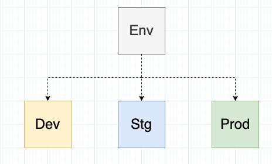

# Kustomize Problem Statement & Ideology (Notes)

We want to start off by going over what problems it tries to address and why it was ultimately created. Let's take a look at simple example:

In this case, we have this Nginx deployment YAML file:
```yaml
apiVersoion: apps/v1
kind: Deployment
metadata:
  name: nginx-deployment
spec:
  replicas: 1
  selector:
    matchLabels:
      app: nginx
  template:
    metadata:
      labels:
        component: nginx
    spec:
      containers:
      - name: nginx
        image: nginx
```

Let's say that we have multiple environments. We're going to have one for development, wich is developing on our local machine, one for staging, and then ultimately one for our production environment.

![[./images/nginx_envs.png]]

<center>
  
</center>
